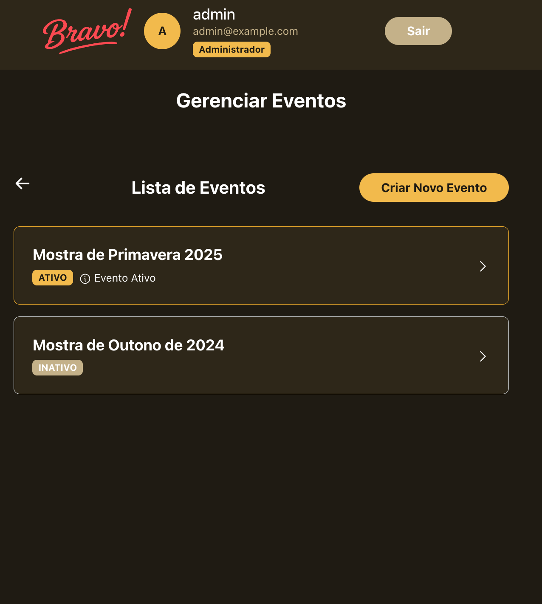
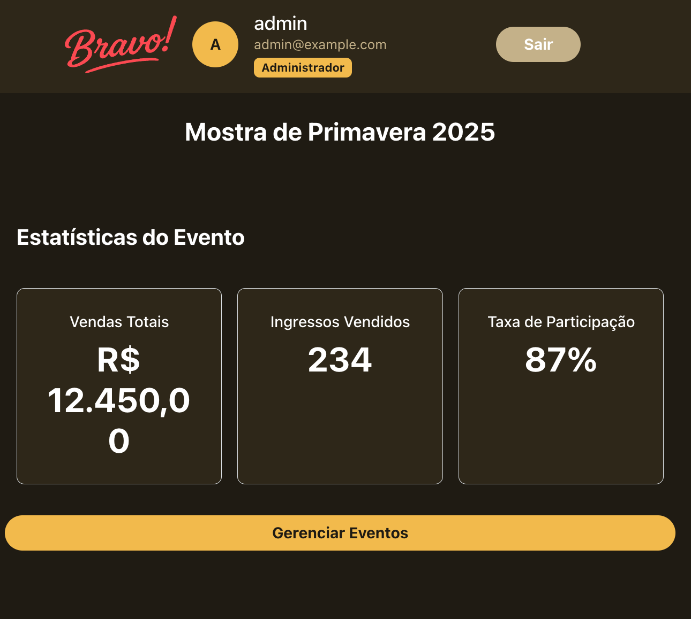
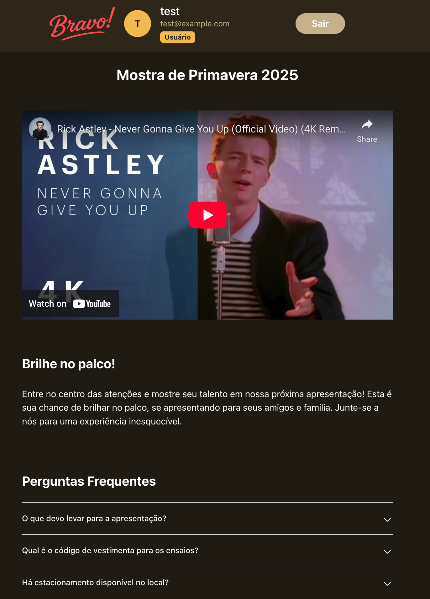
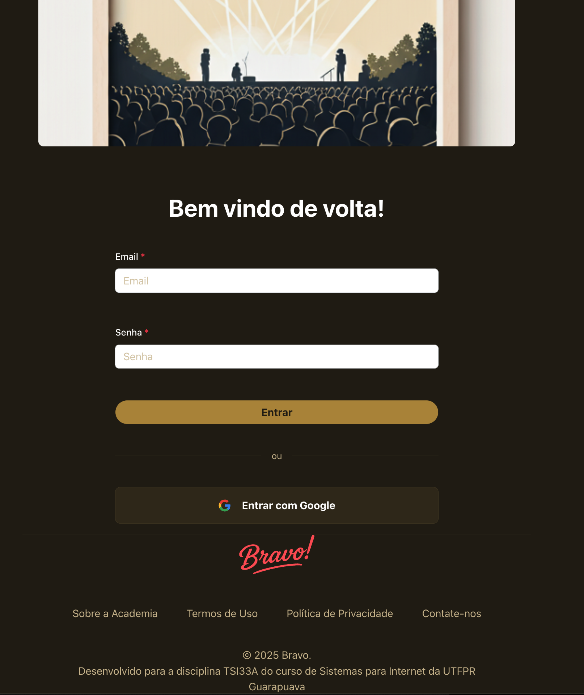

# BRAVO!!

## Description

An application to promote live dance events in theaters for dance school students.

This application is developed under the TSI33A – Front-End Applications Development Using Frameworks and Components course and is a part of Systems for Internet undergraduate course at Federal University of Technology – Paraná, Guarapuava Campus.
---

## Prototype

**Figma prototype:** [Figma prototype](https://www.figma.com/design/F7KYId6cohxkvfpYq4qNKs/Bravo-?node-id=4-2&t=HMKtB8GVXNhpDMHQ-1)

**Design system:** https://www.figma.com/design/F7KYId6cohxkvfpYq4qNKs/tsi33a-bravo?node-id=0-1

**CSS framework:** BootstrapCSS e Angular-Material

**Dependencies:**:

* @angular/cdk: ^20.0.3,
* @angular/common: ^20.0.4,
* @angular/compiler: ^20.0.4,
* @angular/core: ^20.0.4,
* @angular/fire: ^20.0.1,
* @angular/forms: ^20.0.4,
* @angular/material: ^20.0.3,
* @angular/platform-browser: ^20.0.4,
* @angular/platform-browser-dynamic: ^20.0.4,
* @angular/router: ^20.0.4,
* bootstrap: ^5.3.7,
* firebase: ^11.9.1,
* json-server: ^1.0.0-beta.3,
* rxjs: ~7.8.0,
* tslib: ^2.3.0,
* zone.js: ~0.15.0

**Application hosted at:** https://tsi33a-web-components.web.app/ ou em https://tsi33a.thorvi.dev/

**Bravo! pictures:**










---

## TSI33A's requirements checklist

RA1 - **Prototipar e projetar interfaces gráficas de usuário, considerando princípios de usabilidade e experiência do usuário**.

- [x] ID1: Desenvolver protótipos de interfaces que demonstram compreensão das diretrizes de usabilidade.
- [x] ID2: Projetar interfaces responsivas que se adaptam a diferentes tamanhos de tela.

RA2 - **Criar e reutilizar componentes em frameworks frontend, desenvolvendo interfaces modulares, responsivas e estilizadas.**

- [x] ID3: Desenvolver componentes reutilizáveis e que se adaptem de maneira responsiva em vários tamanhos de tela.
- [x] ID4: Incorporar componentes de frameworks CSS.
- [x] ID5: Aplicar diretivas estruturais para exibir ou ocultar elementos de forma condicional.
- [x] ID6: Utilizar diretivas estruturais para repetir elementos de interface de maneira dinâmica, a fim de criar listas, galerias ou outras visualizações baseadas em conjuntos de dados.
- [x] ID7: Aplicar Pipes para formatar a apresentação de dados.

RA3 - **Sincronizar dados entre a interface gráfica e o modelo de dados, aplicando técnicas de binding para manter a consistência.**

- [x] ID8: Aplicar técnicas de one-way data binding, como Interpolation e Property Binding, para exibir e atualizar dados na interface gráfica de maneira unidirecional.
- [x] ID9: Aplicar técnicas de event binding para capturar eventos do usuário na interface e interagir com o modelo de dados.
- [x] ID10: Aplicar técnicas de two-way data binding para criar uma sincronização bidirecional automática entre a interface e o modelo de dados.
- [ ] ID11: Usar variáveis de template para manipulação dinâmica dos dados na interface gráfica.

RA4 - **Implementar comunicação eficaz entre componentes, utilizando padrões de comunicação e serviços para compartilhar lógica e dados.**

- [x] ID12: Criar comunicação entre componentes não relacionados hierarquicamente por meio de serviços através do mecanismo de injeção de dependência.
- [x] ID13: Utilizar as diretivas @Input ou @Output para comunicação em uma hierarquia de componentes.

RA5 - **Criar interfaces de navegação intuitivas e responsivas, implementando roteamento em aplicações de página única (SPA).**

- [x] ID14: Configurar rotas para diferentes partes da aplicação, permitindo a navegação entre páginas distintas.
- [x] ID15: Passar dados entre componentes que representam diferentes telas usando parâmetros de rotas.
- [x] ID16: Criar uma estrutura de navegação aninhada para representar hierarquias de conteúdo.
- [x] ID17: Aplicar guardas de rotas para controlar o acesso a rotas específicas da aplicação, assegurando que somente usuários autorizados possam acessar determinadas partes da interface.

RA6 - **Realizar requisições assíncronas para serviços web, compreendendo os protocolos e formatos de troca de dados, tratando respostas e erros.**

- [x] ID18: Fazer requisições assíncronas a uma API pública para no mínimo a operação GET.
- [x] ID19: Fazer requisições assíncronas a uma API simulada/fake para as operações GET, POST, PUT, PATCH e DELETE.
- [x] ID20: Tratar respostas de sucesso e erros das requisições assíncronas.
- [x] ID21: Aplicar validações de entrada nos campos do formulário, utilizando técnicas como expressões regulares (REGEX), e apresentar mensagens de erro claras e informativas para auxiliar os usuários a corrigir entradas incorretas.
- [x] ID22: Desabilitar adequadamente o botão de submit enquanto o formulário conter campos inválidos, evitando a submissão de dados incorretos.
- [x] ID23: Utilizar Promises para tratar respostas assíncronas.
- [x] ID24: Utilizar Observables para tratar respostas assíncronas.

RA7 - **Gerenciar o código-fonte de maneira eficiente, implementar boas práticas de controle de versão e colaborar em projetos de desenvolvimento.**

- [x] ID25: Criar um repositório no GitHub utilizando a estrutura do Gitflow, estabelecendo as branches "main" e "develop".
- [x] ID26: Colaborar com outros membros do projeto, realizando fusões (merges) e resolução de conflitos.
- [x] ID27: Planejar, configurar e executar o processo de build da aplicação, preparando-a para produção e realizar o deploy em um ambiente de hospedagem.

## How to run this application

```bash
# clone o repositório
$ git clone https://github.com/VitorThorvi/tsi33a-bravo.git bravo

# vá ao diretório do projeto
cd bravo

# instale as dependências
$ npm i

# adicione as variáveis de ambiente recebidas secretamente no caminho src/environments/environment.prod.ts
# rode npm
npm run start

```


